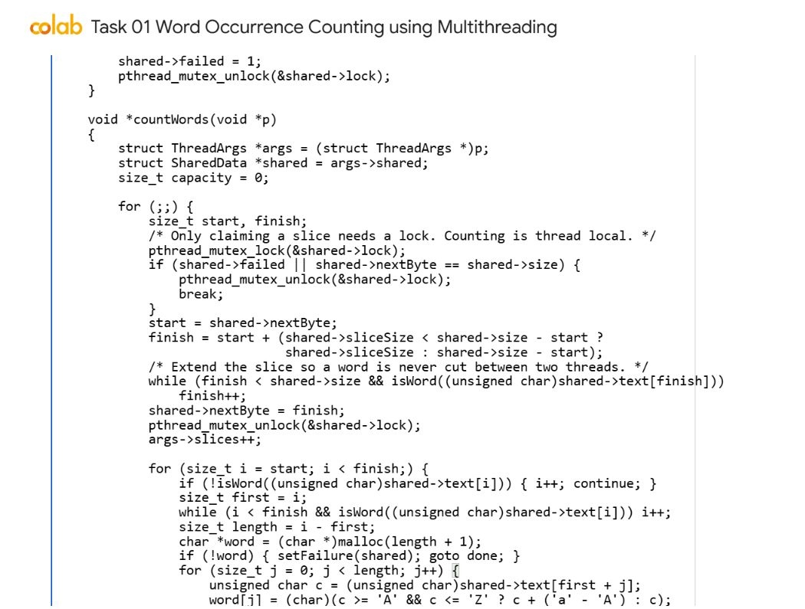
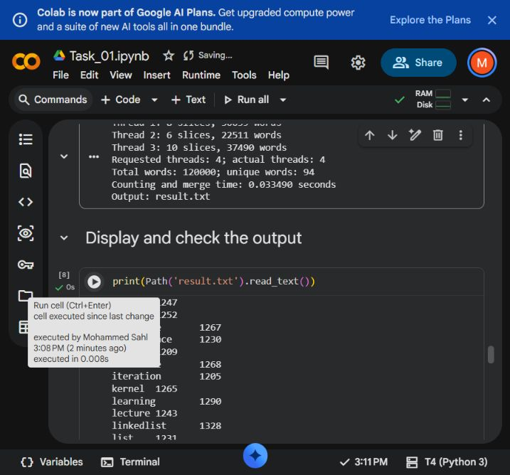

# Task 01 Word Occurrence Counting using Multithreading

Thaslim Mohammed Sahl | 2638120 | 6CS005

[Open task notebook in Colab](https://colab.research.google.com/drive/17fYWnnA4bQEIOrRJl5N6sbBfPTEnoz9i)

[Executed Colab notebook](https://colab.research.google.com/drive/17fYWnnA4bQEIOrRJl5N6sbBfPTEnoz9i)

## Objective

Count every word in the command-line text file using Pthreads, merge the thread results, and write alphabetically ordered frequencies to result.txt. The user also supplies the thread count.


## Implementation

The host reads the file into one dynamically allocated buffer. A word is a run of ASCII letters or digits; letters are converted to lowercase. Spaces and punctuation separate words. For example, CUDA and cuda share one count, while don't is split into don and t. This rule is explicit so both the program and its independent checker interpret the same input.

The initial byte slice is file_size / (8 * actual_threads), with a minimum of one byte. A mutex protects the shared nextByte index. A worker claims a slice, extends its end to the end of a word, updates nextByte, and releases the mutex. It then processes that distinct range without holding the lock. Workers request further slices until the file is exhausted.

Each worker keeps its own growable occurrence array, sorts it with qsort, and compresses repeated words into local frequencies. Main joins all workers before combining their local counts, sorting the combined entries, and summing equal words. No worker writes the output file.

## Code I implemented



I implemented dynamic work allocation with Pthreads. Each worker locks the shared cursor only while claiming its next slice, extends the slice to avoid splitting a word, then unlocks it before scanning the text. Word counts are stored in each worker's own collection before the results are merged.

Source excerpt: WordOccurrence.c, countWords, lines 55 to 79. The full source remains in WordOccurrence.c.


## Synchronisation and memory

Extending the end of each claimed slice prevents a word from being counted twice or split into fragments. The next slice starts exactly where the previous one ended. Every claimed byte range is disjoint and the final range ends at the file size.

Only the work-claim index and allocation-failure flag need mutex protection. File bytes are read-only and count arrays belong to individual threads. pthread_join establishes that each local result is complete before the host reads it. The mutex is destroyed after all joins. Every word allocation, local array, merged array, thread array, and input buffer is released.


## Results and tests

The supplied WordOccurrenceDataset.txt produced 120,000 words and 94 unique words. Results matched an independent Python Counter at 1, 2, 3, 7 and 16 threads, including their exact alphabetical order and total frequency.

Boundary tests covered a 20,000-character word, CRLF, tabs, punctuation, digits, no final newline, and non-divisible workloads. An empty file produced a valid header with no word rows. Zero, negative, non-numeric, and out-of-range thread counts, missing files, and missing arguments returned errors.

AddressSanitizer and UndefinedBehaviorSanitizer passed on the supplied dataset with seven threads. The program prints thread IDs and per-thread slice counts; their distribution can vary with scheduling without changing the final frequencies.


## Colab execution evidence



The captured program summary shows four requested and four actual Pthreads, 120,000 total words and 94 unique words. It names result.txt as the output file. The next cell displays part of the word-frequency file. These visible results document the supplied dataset run; the independent checks described above also test thread counts and boundary cases.

## Performance and limits

Counting and merging require memory proportional to the number of occurrences and local unique entries. Sorting takes O(W log W) across the collected words. File loading and the final merge are serial. The word definition is ASCII and does not perform Unicode language segmentation.

The recorded single-run counting and merge times were 45.915 ms with one thread and 37.812 ms with two threads. These are observations from one run, not stable speedup estimates. Colab scheduling, allocation overhead, and serial work affect the times. More threads must not be assumed to improve performance.

## Build and run

```sh
gcc -std=c11 -O2 -pthread WordOccurrence.c -o WordOccurrence
./WordOccurrence WordOccurrenceDataset.txt 4
```