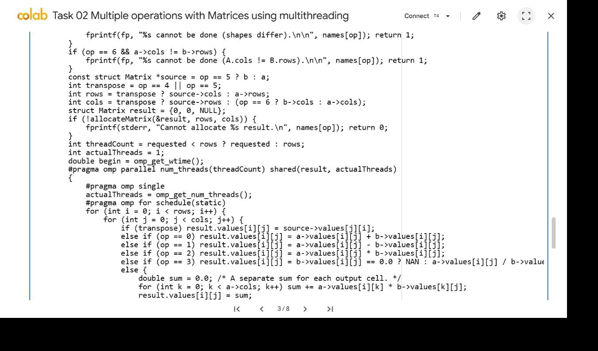
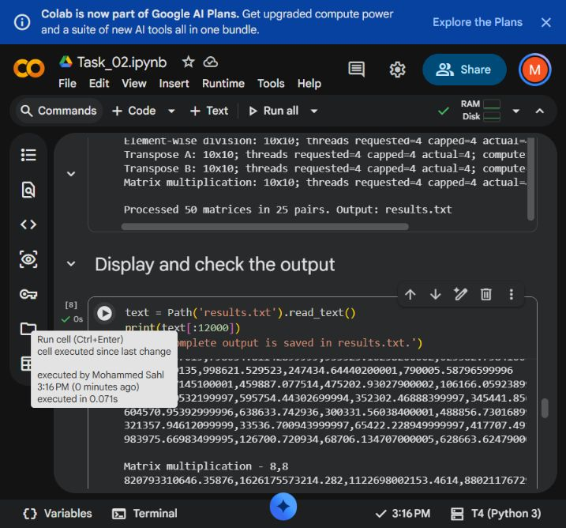

# Task 02 Multiple operations with Matrices using multithreading

Thaslim Mohammed Sahl | 2638120 | 6CS005

[Open task notebook in Colab](https://colab.research.google.com/github/sahl-2003/HPC/blob/main/Practical%20Task/Task%2002/Task_02.ipynb)

[Executed Colab notebook](https://colab.research.google.com/drive/1mOq3OAuv3eOWKYj5IPSLim6wXH0npTHJ)

## Objective

Read the input path from argv[1] and the requested OpenMP thread count from argv[2]. Process matrices as consecutive pairs and write the full set of valid results and inapplicable-operation messages to results.txt.


## Implementation

The input uses a rows,cols header followed by exactly rows lines of comma-separated numeric values. Blank lines are permitted between matrices. fopen, fscanf, fprintf and fclose perform file I/O. fscanf reads characters into a growable line buffer, so row boundaries remain significant. strtol and strtod validate headers and complete numeric tokens.

Matrices use malloc for the row pointer array and each row of doubles, following the lecturer's matrix examples. The complete file is validated before results.txt is opened. Input errors identify the matrix, row or line, and allocated data is released. An odd matrix count is rejected because it cannot form complete pairs.

For equal shapes the program computes A+B, A-B, A.*B and A./B. A zero divisor produces NaN in that cell. Both transposes are always computed. A*B is computed only when A.cols equals B.rows; its cell is the dot product sum over k. Every unavailable operation gets one clear message and the remaining operations continue.

## Code I implemented



I implemented the matrix operations inside an OpenMP parallel region. Static scheduling gives different output rows to different threads, with the thread count capped by the number of rows. Each matrix-product cell uses its own local sum, so workers write separate result cells without sharing an accumulator.

Source excerpt: MatrixOperations.c, operation, lines 188 to 210. The full source remains in MatrixOperations.c.


## Synchronisation and memory

For each operation the result row count is the number of outer loop iterations. The thread cap is min(requested_threads, result_rows). This prevents more requested workers than result rows. The program prints the requested, capped and actual OpenMP team sizes.

The outer row loop uses omp for with a static schedule. The input matrices are shared and read-only. Iteration variables and the dot-product sum are local to the calculation, and each output cell has one writer. The implicit barrier completes the computation before fprintf reads the result. A shared reduction is unnecessary because the sum belongs to one cell, not to the whole result.

Every output includes the pair identifier, operation name and dimensions, followed by comma-separated rows. Results use 17 significant digits to preserve double precision. Row allocations are freed individually before the pointer array is freed. Overflow checks precede allocations.


## Results and tests

All 50 supplied matrices were processed as 25 pairs. Every applicable output from requested thread counts of 1, 4 and 64 matched NumPy, using relative tolerance 1e-12 and absolute tolerance 1e-10. The checker also verified operation messages, pair order, dimensions and thread caps.

Additional fixtures covered square matrices, rectangular matrix products, pairs with different shapes, one-row matrices and division by zero. Thirteen invalid files tested empty input, odd counts, bad headers, missing or extra row values, non-numeric tokens, NaN, infinity and numeric overflow. Missing files and invalid thread arguments were also rejected.

AddressSanitizer and UndefinedBehaviorSanitizer passed on the supplied file with 64 requested threads. Pair 1 has two 3x4 matrices: element-wise operations and both transposes are valid, while the matrix product is not. Pair 2 has 4x6 and 6x2 matrices: the product and transposes are valid, while the four element-wise operations are not.


## Colab execution evidence



The visible summary reports 50 matrices processed as 25 pairs and names results.txt. The output preview below contains numeric matrix rows and a matrix multiplication heading with its result dimensions. This confirms that the program writes matrix results to the required file. The separate NumPy comparisons verify every applicable operation, including rows that are outside this screenshot.

## Performance and limits

A matrix product of m x k and k x n requires O(mkn) arithmetic. Element-wise operations and transposes require O(mn). All input matrices remain in host memory until validation and processing finish; result memory is allocated one operation at a time.

Many supplied matrices are small. Opening an OpenMP team for a short loop can cost more than its arithmetic. This implementation follows the required thread cap and records actual team sizes, but a small workload does not establish a speed advantage. Parsing, output formatting, and file writes remain serial.

## Build and run

```sh
gcc -std=c11 -O2 -fopenmp MatrixOperations.c -lm -o MatrixOperations
./MatrixOperations MatData.txt 4
```