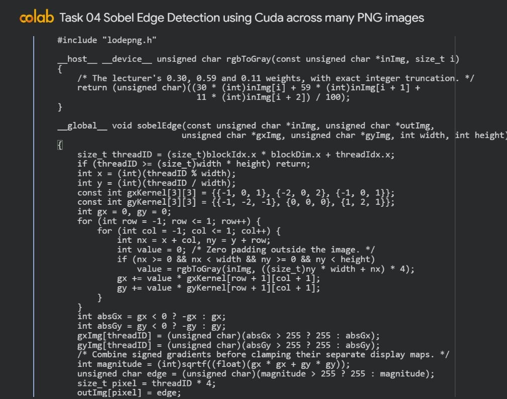
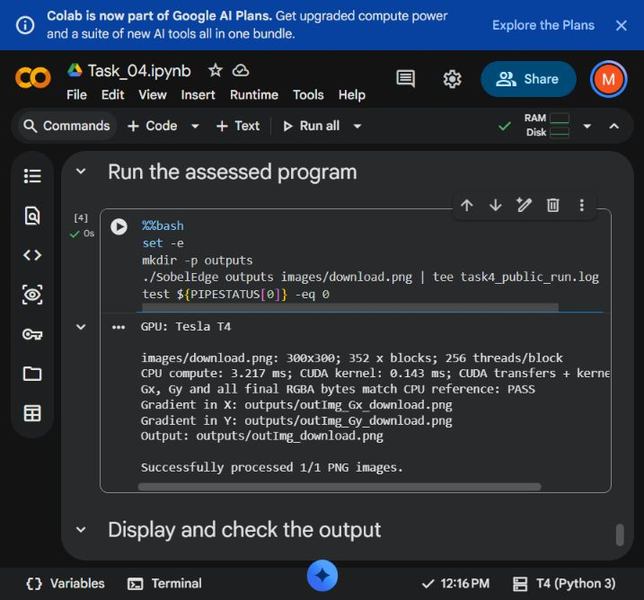
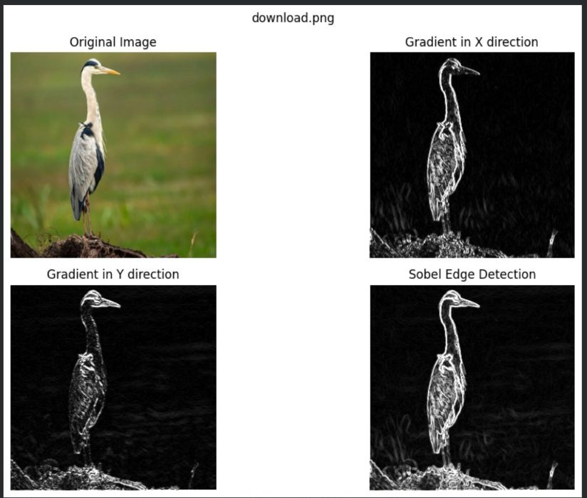

# Task 04 Sobel Edge Detection using Cuda across many PNG images

Thaslim Mohammed Sahl | 2638120 | 6CS005

[Open task notebook in Colab](https://colab.research.google.com/drive/1N2NxvodTA4TeiNAUY0JtYP0_kALg1uOE)

[Executed Colab notebook](https://colab.research.google.com/drive/1N2NxvodTA4TeiNAUY0JtYP0_kALg1uOE)

## Objective

Use one public input image, download.png, to demonstrate the brief's four views: Original Image, Gradient in X direction, Gradient in Y direction and Sobel Edge Detection. The four panels are views of the same input. Save both gradient maps and the combined edge map at the original dimensions. The CUDA program also accepts multiple PNG paths when a batch is required.


## Implementation

The notebook automatically downloads lodepng.cpp, lodepng.h and download.png (300x300) from the public GitHub project. The image is an unchanged copy of the public input in the last-class teaching example. The files are taken from a fixed project revision, so every fresh runtime uses the same inputs. LodePNG decodes the image into an RGBA host array, with its original licence notices retained.

The last-class sample demonstrates PNG decoding, explicit CUDA memory transfers and rgbToGray; its final kernel stops at grayscale conversion. This implementation extends that workflow with the assessed Sobel convolution. Luminance uses the lecturer's 0.30R + 0.59G + 0.11B weights as (30*R + 59*G + 11*B) / 100, rounded down. Integer arithmetic gives identical CPU and GPU truncation. Gx is [-1,0,1; -2,0,2; -1,0,1] and Gy is [-1,-2,-1; 0,0,0; 1,2,1]. Out-of-image neighbours are zero.

Gx measures left-to-right intensity changes and Gy measures top-to-bottom changes, following the written axis definitions. The kernel saves min(255, abs(Gx)) and min(255, abs(Gy)) in separate one-byte-per-pixel display buffers. The final magnitude uses the original signed sums: sqrt(Gx*Gx + Gy*Gy), then truncation and saturation at 255. Clipping a display map never changes that calculation. The final edge value fills RGB and preserves input alpha; the separate gradient maps contain grayscale intensity only.

RGBA input and final output arrays each use width*height*4 bytes. Each gradient array uses width*height bytes. The x grid has ceil(pixel_count/256) blocks and a guard for padded threads. The command accepts any number of PNGs. Output names are outImg_, outImg_Gx_ and outImg_Gy_ followed by the input basename. The host rejects duplicate or colliding generated names before processing. Gradient encoding uses lodepng_encode_file with LCT_GREY, 8, matching the lecturer's grayscale-buffer workflow.

## Code I implemented



I implemented one CUDA thread per image pixel to calculate the X and Y gradients using the Sobel masks. Neighbours outside the image use zero padding, and the two signed gradient sums are combined with sqrt(Gx*Gx + Gy*Gy). I clamp the separate gradient display maps and the final magnitude to the 8-bit image range.

Source excerpt: SobelEdge.cu, sobelEdge, lines 22 to 46. The full source remains in SobelEdge.cu.


## Synchronisation and memory

Checked kernel completion precedes device-to-host copies of all three maps. A serial C reference expresses the gradients as neighbour sums and compares every final RGBA byte and both gradient buffers. An independent NumPy checker verifies all saved maps and their dimensions, including alpha in the final edge image.

Every successful output has exactly the original image dimensions. Zero padding can produce a visible edge around a constant bright image because its boundary neighbours are black. This is expected under the specified padding rule. PNG decode or encode failures and CUDA failures return errors; the batch can continue to a later valid input.

Images are processed one at a time. Host image and reference buffers, all four device buffers and timing events are released after each image, including failure paths. Working memory depends on the largest image. Gradients are encoded losslessly from 8-bit grayscale buffers; LodePNG can optimise the file's storage without changing its decoded intensities.


## Results and tests

The revised notebook downloaded its single demonstration image live on the Tesla T4. Every pixel in the X gradient, Y gradient and final edge maps matched the references across 14 PNG test inputs. The public demonstration uses only download.png; additional small generated fixtures check zero padding, saturation, final-image transparency, grayscale rounding and padded launches.

Directional fixtures independently check that a horizontal ramp has zero interior Gy and a vertical ramp has zero interior Gx. Negative gradients remain visible through their absolute values. A constructed 3x3 patch gives Gx=6, Gy=8 and final magnitude 10 at its centre, reproducing the brief's numerical example. Corrupt files, invalid paths, duplicate inputs and cross-output filename collisions are also tested; a batch continues to a valid image after a corrupt one.

The updated 300x300 download.png run took 3.217 ms for serial CPU computation, 0.143 ms for the CUDA kernel, and 1.950 ms for transfers plus kernel. These are single-run observations. GPU allocation, PNG decoding and encoding are outside the transfer-and-kernel interval. The first CUDA invocation has additional startup overhead, so timings are not stable benchmark estimates.


## Colab execution evidence



This capture records the notebook run for the 300x300 download.png image on the T4 runtime. Its output identifies the X gradient, Y gradient and final edge PNGs. The reference comparison checks these maps against the serial C calculation. The independent NumPy tests check the saved PNG pixels and gradient directions separately.



The upper-left panel is the original colour image. The upper-right panel displays the absolute X gradient, which responds to left-right intensity changes; the lower-left displays the absolute Y gradient, which responds to top-bottom changes. The lower-right panel is the combined Sobel magnitude. Each map is calculated by the CUDA kernel from the same original pixels. Display values are clamped to 255, while the final magnitude uses the signed, unclipped Gx and Gy sums. All four views retain the 300x300 image dimensions.

## Performance and limits

The implementation uses global memory and a basic one-thread-per-pixel kernel, matching the taught CUDA model. It does not use shared-memory tiling or concurrent image streams. Reading overlapping neighbourhoods repeats memory accesses, but the independent output ownership makes correctness straightforward.

Converting colour to luminance detects intensity edges. It does not preserve coloured edge directions. Very small images can be slower on the GPU once transfer and launch costs are included. The report separates the timing intervals to avoid implying that kernel speed is total application speed.

## Build and run

```sh
nvcc -O2 -arch=sm_75 lodepng.cpp SobelEdge.cu -o SobelEdge
mkdir -p outputs
./SobelEdge outputs images/download.png
```
